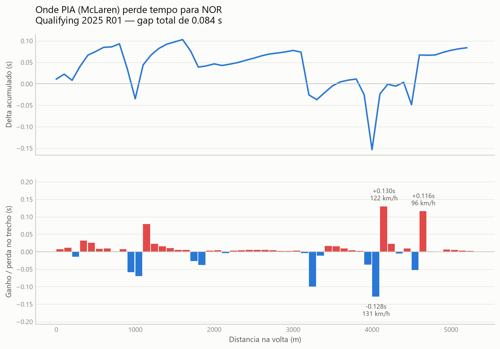

<p align="center">
  
  
  
</p>

# f1-quali-gaps

Pipeline de análise de gaps de qualifying da Fórmula 1.

> Projeto de estudo de 21 dias em analytics engineering — escopo pequeno de
> propósito, decisões técnicas documentadas passo a passo (`docs/adrs/`),
> incluindo a que deu errado primeiro.

**Pergunta de negócio:** onde, especificamente, um piloto ganha ou perde tempo
em relação ao pole sitter numa volta de qualifying?

Tempo de setor não responde isso — setor é grosso demais para apontar curva.
Este projeto reconstrói o delta ponto a ponto da volta, a partir de telemetria.

## Sumário

- [O que ele mostra](#o-que-ele-mostra)
- [Como rodar](#como-rodar)
- [Arquitetura](#arquitetura)
- [O problema central, e como foi resolvido errado primeiro](#o-problema-central-e-como-foi-resolvido-errado-primeiro)
- [Testes](#testes)
- [Decisões registradas](#decisões-registradas)
- [Limitações conhecidas](#limitações-conhecidas)

## O que ele mostra

Qualifying da Austrália 2025. Piastri terminou 0,084 s atrás de Norris. O
pipeline mostra que esse número esconde uma volta em que ele passou quase todo
o último setor **na frente**:

| Trecho | Ganho/perda | Acumulado | Vel. mínima |
|---|---|---|---|
| 4000–4100 m | **−0,128 s** (ganhou) | −0,153 s | 131 km/h |
| 4100–4200 m | **+0,130 s** (perdeu) | −0,024 s | 122 km/h |
| 4500–4600 m | −0,052 s (ganhou) | −0,049 s | 110 km/h |
| 4600–4700 m | **+0,116 s** (perdeu) | **+0,067 s** | 96 km/h |

Duas coisas aparecem aqui, e nenhuma é visível num tempo de setor. Primeiro,
entre 4000 e 4200 m ele ganha 0,128 s e devolve 0,130 s no trecho seguinte:
entra mais rápido e paga na saída. Segundo, e decisivo: ele chega em 4600 m
ainda 0,049 s na frente e perde 0,116 s numa única curva de 96 km/h. É ali que
a volta vira — não no tempo total.



O painel de cima é o placar acumulado; o de baixo é onde agir. Vermelho é tempo
perdido no trecho, azul é tempo ganho. O `.csv` gerado ao lado do gráfico tem os
mesmos números em tabela, para quem não lê pela cor.

## Como rodar

```powershell
# Setup (Windows / PowerShell)
python -m venv .venv
.venv\Scripts\Activate.ps1
pip install -e ".[dev]"

# Ingestão: FastF1 -> Parquet
python -m ingest.extract --season 2025 --round 1

# Transformação e testes
cd f1_dbt
dbt build

# Gráfico + tabela equivalente
python -m analysis.visualizations --driver PIA
```

Qualidade:

```powershell
ruff check .
pytest tests/ -v
```

## Arquitetura

```
FastF1  ->  Parquet (raw)  ->  DuckDB  ->  dbt  ->  gráfico
         ingest/                        staging      analysis/
                                        intermediate
                                        marts
```

| Ferramenta | Por quê |
|---|---|
| FastF1 | API pública já resolve autenticação, formato e cache da telemetria oficial |
| Parquet | Colunar, tipado, comprime bem — melhor que CSV para ler parcialmente |
| DuckDB | Warehouse analítico como arquivo único, zero infraestrutura no CI |
| dbt-core + dbt-duckdb | Transformação em SQL versionado, com teste declarativo e linhagem |
| matplotlib | Gráfico estático — sem servidor, fora do escopo deste projeto |

- **Python move, SQL transforma.** `ingest/` não sabe o que é um gap; toda regra
  de negócio vive no dbt.
- **Raw imutável.** Parquet cru e reprocessável: bug de decodificação se
  conserta sem baixar tudo de novo.
- **Idempotente.** Rodar a ingestão duas vezes produz arquivos com hash
  idêntico. Verificado, não presumido.

Modelos:

| Camada | Modelo | Papel |
|---|---|---|
| staging | `stg_fastf1__laps`, `stg_fastf1__telemetry` | 1:1 com o raw, tipagem e renomeação |
| intermediate | `int_interpolate__telemetry_grid` | reamostra todas as voltas numa base comum |
| intermediate | `int_compute__delta_to_pole` | calcula o delta contra o pole |
| marts | `fct_qualifying_gaps`, `dim_driver` | consumo, por trecho de 100 m |

## O problema central, e como foi resolvido errado primeiro

Comparar duas voltas exige compará-las no mesmo ponto da pista. O dado não
entrega isso: cada piloto tem ~576 amostras em instantes diferentes, e a
distância da FastF1 é derivada integrando velocidade, então acumula erro
próprio de cada carro — a mesma volta mede de 5.219,6 m a 5.252,0 m.

A primeira versão ([ADR-0003](docs/adrs/0003-grade-de-distancia.md)) usou uma
grade de metros absolutos. O teste de reconciliação reprovou: o delta
reconstruído subestimava o gap de 17 dos 18 pilotos, e o erro tinha correlação
de **−1,0** com a distância máxima de cada piloto. Correlação perfeita — não
era ruído, era o método.

A correção ([ADR-0004](docs/adrs/0004-base-de-comparacao-relativa.md)) foi
comparar em **posição relativa** (0 = início da volta, 1 = chegada) em vez de
metros. Isso é válido porque foi medido que a telemetria de cada piloto cobre
exatamente uma volta cronometrada (sobra de 0,000 s para os 19). Depois da
mudança, o delta reconstruído bate com o cronômetro oficial **exatamente**,
para todos os pilotos.

O teste que reprovou o método continua no `dbt build`, agora com tolerância de
0,01 s. Ele já provou que funciona — e foi testado de novo contra Mônaco, o
oposto físico de Melbourne (curvas fechadas, baixíssima velocidade), onde a
causa raiz do erro original é proporcionalmente mais forte. A reconciliação se
manteve exata mesmo lá (detalhes no adendo do ADR-0004).

## Testes

`dbt build` roda 35 testes. Três deles não verificam só se o dado chegou:

- **`assert_sector_times_reconcile_with_lap_time`** — a soma dos três setores
  bate com o tempo de volta. Valida a premissa sobre o dado de origem.
- **`assert_final_delta_matches_lap_time_gap`** — o delta acumulado na chegada
  bate com a diferença real de tempo de volta. Valida a matemática contra um
  número que não passou por interpolação nenhuma: o cronômetro.
- **`assert_single_session_loaded`** — reprova o build se houver mais de uma
  sessão no raw. Nenhum model particiona por sessão ([ADR-0005](docs/adrs/0005-trava-de-sessao-unica.md)),
  então misturar duas sessões produziria delta errado sem avisar.

Mais 9 testes Python (`pytest`) nas funções puras da ingestão.

## Decisões registradas

| ADR | Assunto |
|---|---|
| [0001](docs/adrs/0001-stack.md) | Stack: FastF1, DuckDB, dbt |
| [0002](docs/adrs/0002-granularidade-do-raw.md) | Granularidade da camada raw |
| [0003](docs/adrs/0003-grade-de-distancia.md) | Grade de distância — **substituído** |
| [0004](docs/adrs/0004-base-de-comparacao-relativa.md) | Posição relativa como base de comparação, validado contra Mônaco |
| [0005](docs/adrs/0005-trava-de-sessao-unica.md) | Trava explícita de sessão única |

## Limitações conhecidas

- Telemetria só da volta válida mais rápida de cada piloto (ADR-0002). Piloto
  sem volta válida não aparece na análise — o log da ingestão avisa quando isso
  acontece.
- A extração pega a volta mais rápida sem verificar se ela foi deletada por
  limite de pista. Verificado em 2025 R01: nenhuma foi.
- Uma sessão por vez. Comparação entre corridas não está no escopo, e é
  imposta por teste (ADR-0005), não só por convenção.

## Licença

Ainda não definida. Se você está lendo isto antes de eu decidir, pode assumir
que o código está aqui para leitura e estudo.
